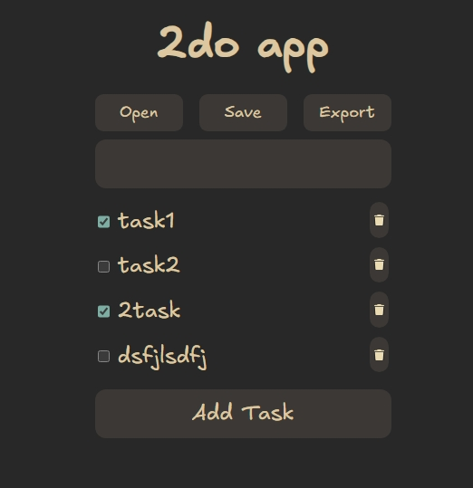

# 2do-app

2do-app is a simple todo app with a CLI and GUI frontend. It supports adding, deleting and editings todos in your todolist. You can export todolist to save it in your computer as well.

## Screenshot


## Build

### NOTE: All the commands here need to be run in Windows Powershell or Linux/Mac OS Terminal

### To build the CLI:

**Requirements**: A modern version of golang compiler

```bash
git clone https://github.com/ritchielrez/2do-app
cd 2do-app/2do-cli/
go build 2do-cli.go
```

### To build the GUI:

**Requirements**: Node.js, npm

```bash
git clone https://github.com/ritchielrez/2do-app
cd 2do-app/2do-gui
npm i
npm run build
```

Alternatively to run the GUI, run this command `npm run dev`. Then go to your browser and go to `http://localhost:5173/`.

## Usage

For the CLI, just run `2do-cli --help` to see all the actions you can perform.

## Contributing

Pull requests are welcome. For major changes, please open an issue first
to discuss what you would like to change.

Please make sure to update tests as appropriate.

## License

[MIT](./LICENSE)
